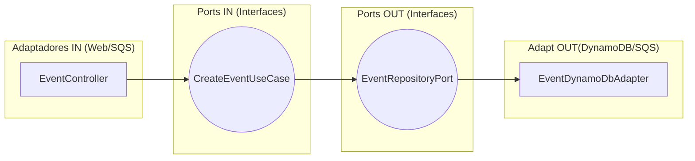

# Explicación: Puertos y Adaptadores (Arquitectura Hexagonal)

Esta guía explica la lógica de comunicación entre las capas de nuestro sistema, basada en el patrón de **Puertos y Adaptadores**.

---

## 1. El Núcleo: Los Puertos (Interfases)

Los **Puertos** definen *qué* puede hacer el sistema sin importar *cómo* se haga. Son simplemente interfaces de Java.

### Port IN (Entrada)
- **Definición**: Son las interfaces que exponen la lógica de negocio al mundo exterior.
- **Ubicación**: `domain.port.in`
- **Ejemplo**: `ReserveTicketsUseCase`.
- **Analogía**: Es el "enchufe" donde conectamos los disparadores (como el Controller de la API).

### Port OUT (Salida)
- **Definición**: Son las interfaces que el sistema necesita para hablar con el mundo exterior (Bases de datos, Colas).
- **Ubicación**: `domain.port.out`
- **Ejemplo**: `EventRepositoryPort`.
- **Analogía**: Es el "manual de instrucciones" de lo que el sistema necesita guardar o enviar.

---

## 2. Los Bordes: Los Adaptadores (Implementación)

Los **Adaptadores** son la implementación técnica de los puertos. Se preocupan por el *cómo*.

### Adapter IN (Web / Message Queue)
- **Definición**: "Manejan" el tráfico que llega de afuera hacia el núcleo.
- **Ubicación**: `infrastructure.adapter.in`
- **Componentes**: 
  - `EventController`: Traduce HTTP a llamadas de Use Case.
  - `OrderSqsConsumer`: Traduce mensajes de SQS a llamadas de Use Case.
- **Dirección**: Adapter IN → Port IN.

### Adapter OUT (Persistence / Messaging)
- **Definición**: Implementan la lógica técnica para hablar con servicios externos.
- **Ubicación**: `infrastructure.adapter.out`
- **Componentes**:
  - `EventDynamoDbAdapter`: Implementa `EventRepositoryPort` usando el SDK de AWS.
  - `OrderSqsAdapter`: Implementa `OrderQueuePort` para enviar mensajes.
- **Dirección**: Port OUT → Adapter OUT.

---

## 3. El Flujo de Dependencias (Regla de Oro)

En Clean Architecture, **las dependencias solo deben apuntar hacia adentro**.

1.  El **Controller** (Adapter In) depende de la **Interfaz** (Port In).
2.  El **UseCaseImpl** (Application) implementa el **Port In** y depende de la **Interfaz** (Port Out).
3.  El **DynamoDbAdapter** (Adapter Out) implementa el **Port Out**.

### El Diagrama Mental:

---
