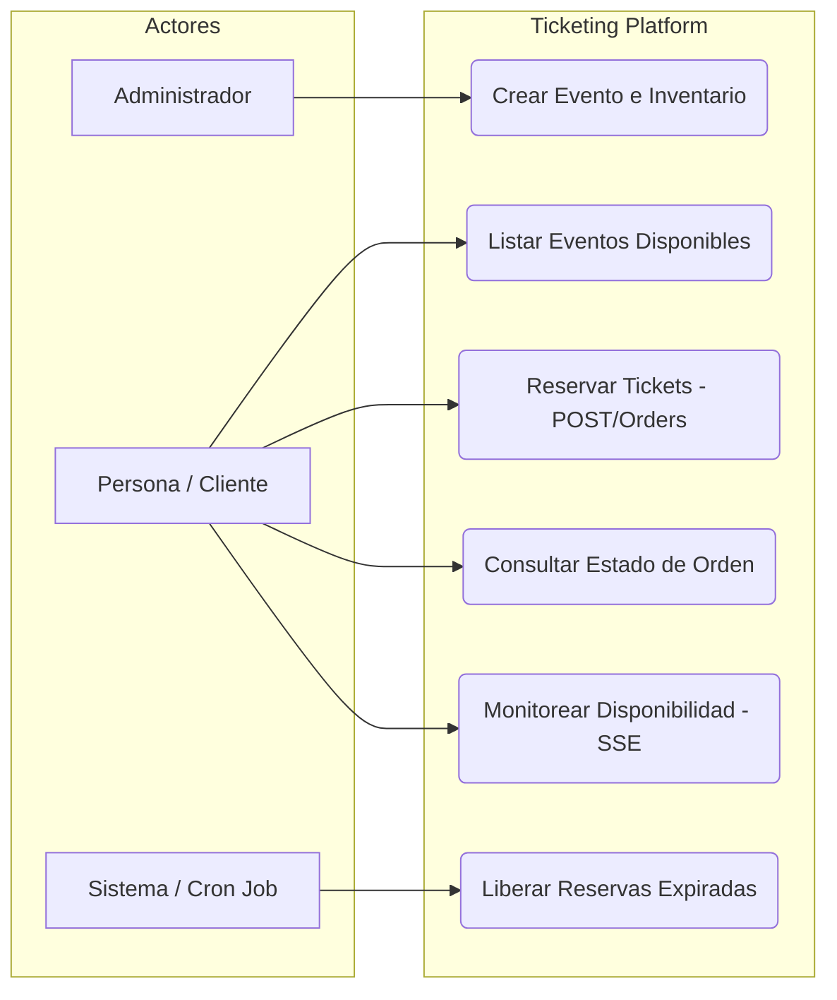
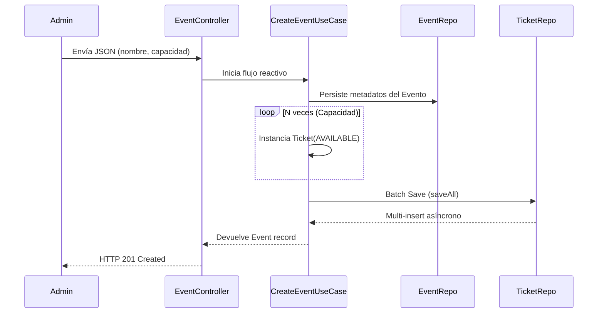
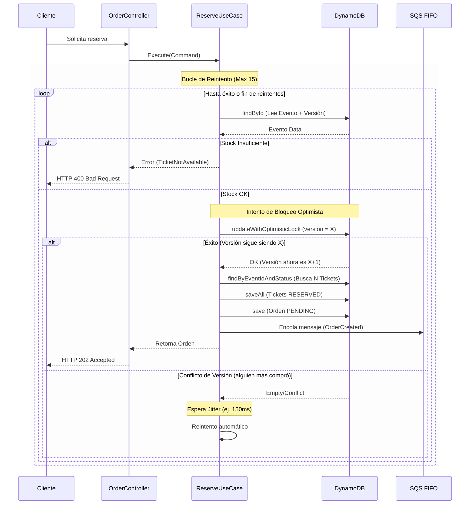
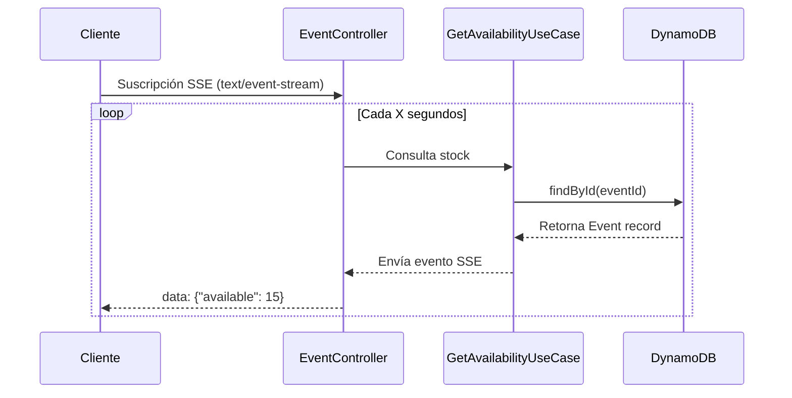
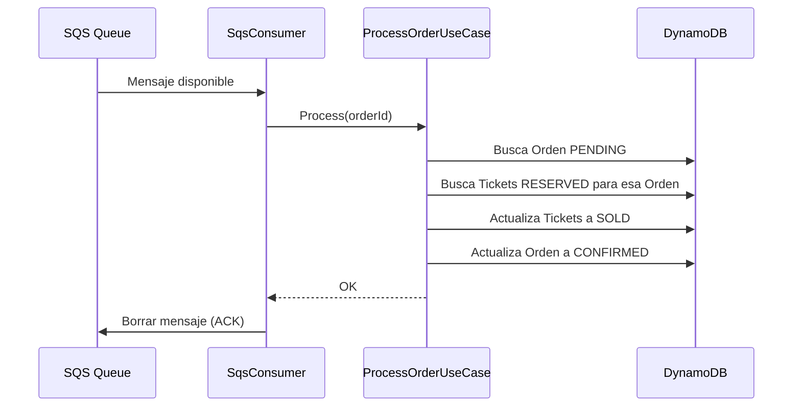

# Diagramas de Casos de Uso y Flujos de Endpoint

Este documento detalla los casos de uso del sistema y los flujos lógicos para cada punto de entrada (Endpoint/Job).

---

## 1. Mapa General de Casos de Uso

Representa las funcionalidades disponibles para cada actor del sistema.

---

## 2. Flujo: Creación de Evento (`POST /api/v1/events`)

**Caso de Uso:** El administrador registra un nuevo evento y el sistema genera automáticamente el inventario físico (tickets).

---

## 3. Flujo: Reserva de Tickets (`POST /api/v1/orders`)

**Caso de Uso:** Un cliente solicita reservar N boletas. Es el flujo más crítico por la concurrencia.

---

## 4. Flujo: Disponibilidad SSE (`GET /events/{id}/availability`)

**Caso de Uso:** El cliente desea ver el stock en tiempo real sin recargar la página.

---

## 5. Flujo: Procesamiento Asíncrono (SQS Consumer)

**Caso de Uso:** Confirmar la venta final tras la reserva exitosa.

