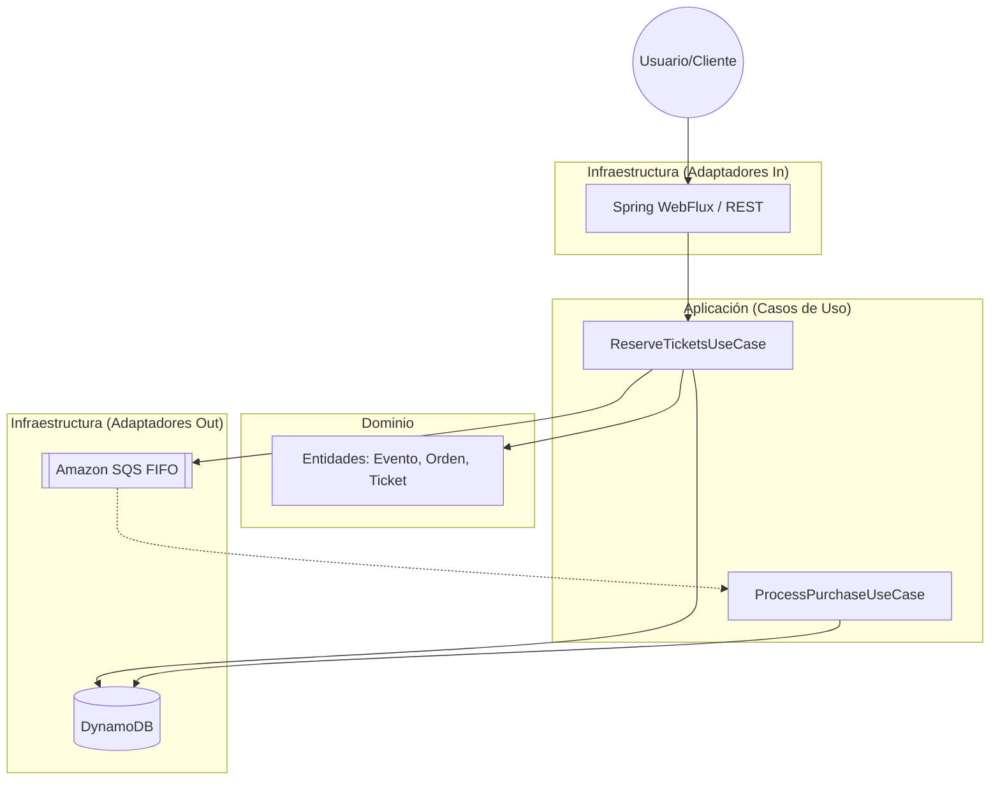
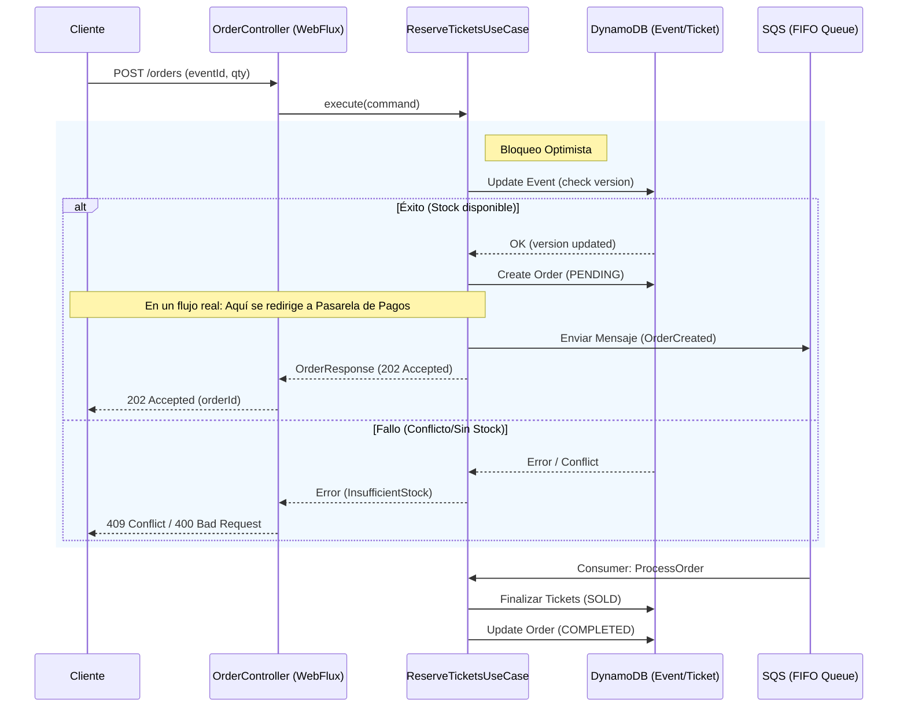
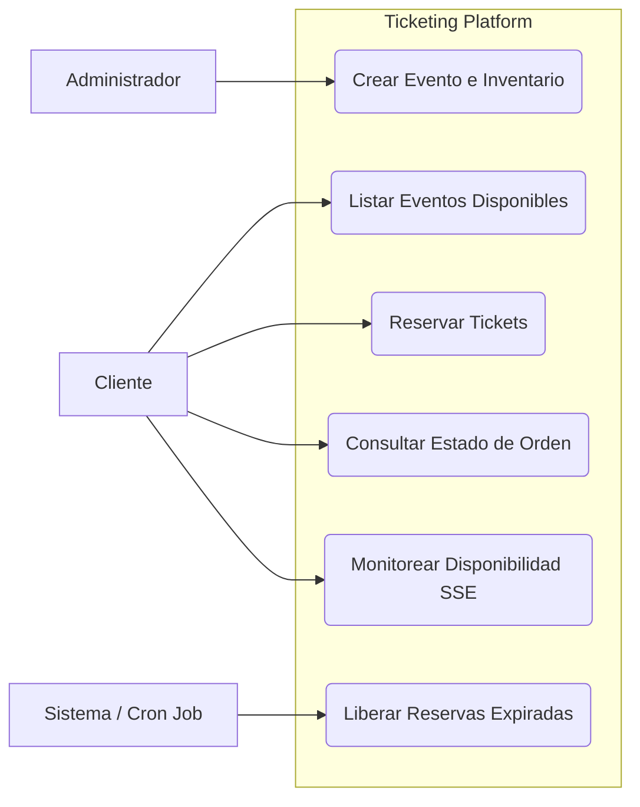
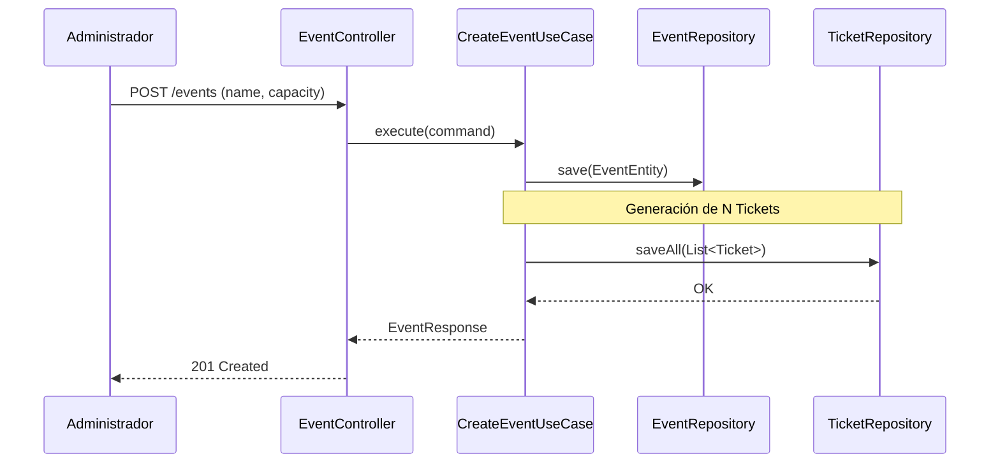
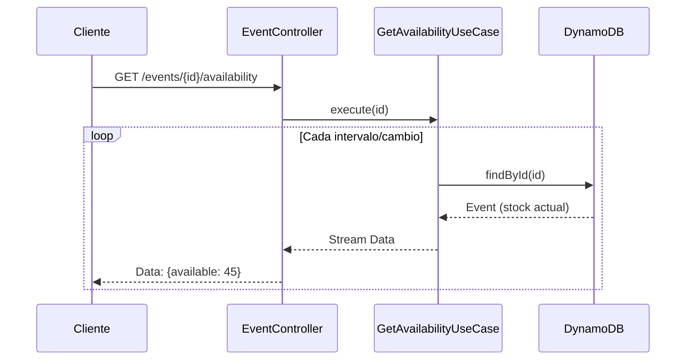
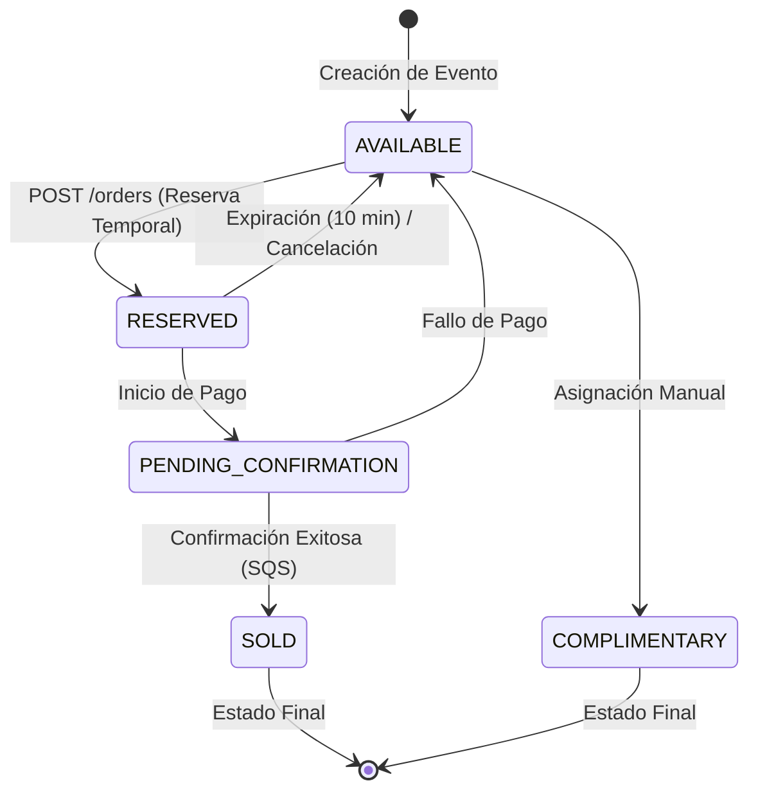
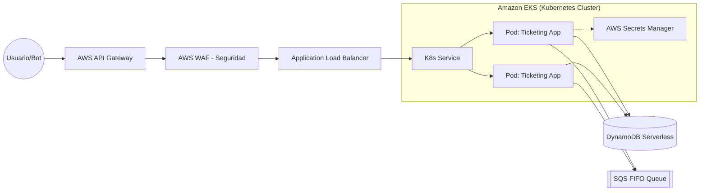

# Diagramas de Arquitectura - Ticketing Reactive

Este documento contiene la representación visual de la arquitectura y los flujos críticos del sistema.

## 1. Arquitectura de Alto Nivel

El sistema utiliza una **Arquitectura Hexagonal (Clean Architecture)** impulsada por eventos y programación reactiva.

## 2. Flujo de Reserva de Tickets (Secuencia)

Este diagrama muestra cómo se maneja la concurrencia y la asincronía durante una compra.

## 3. Diagrama de Casos de Uso (UML)

Este mapa muestra las interacciones de los actores con las funcionalidades del sistema.

## 4. Flujo: Creación de Evento (Secuencia)

## 5. Flujo: Disponibilidad en Tiempo Real

## 6. Diagrama de Estados: Ciclo de Vida del Ticket

Indispensable para entender las "Notas Generales" del negocio.

## 8. Arquitectura de Despliegue en Producción

Esta arquitectura está diseñada para maxima disponibilidad, seguridad y escalabilidad automática en la nube.

