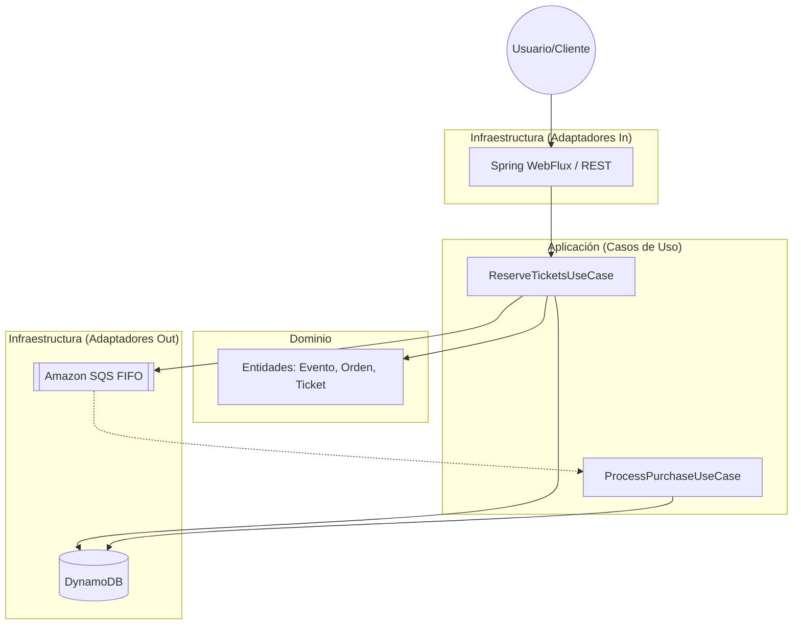
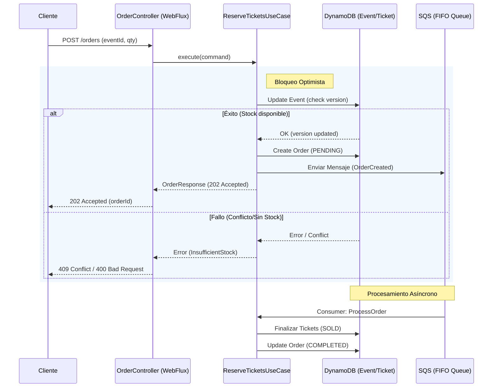

# Diagramas de Arquitectura - Nequi Ticketing Reactive

Este documento contiene la representación visual de la arquitectura y los flujos críticos del sistema.

## 1. Arquitectura de Alto Nivel

El sistema utiliza una **Arquitectura Hexagonal (Clean Architecture)** impulsada por eventos y programación reactiva.



## 2. Flujo de Reserva de Tickets (Secuencia)

Este diagrama muestra cómo se maneja la concurrencia y la asincronía durante una compra.



## 3. Modelo de Datos (DynamoDB)

### Tabla: `events`
- `eventId` (Hash Key)
- `availableTickets`
- `version` (para Optimistic Locking)

### Tabla: `tickets`
- `ticketId` (Hash Key)
- `eventId` (GSI)
- `status` (AVAILABLE, SOLD, RESERVED)
- `orderId` (GSI)

### Tabla: `orders`
- `orderId` (Hash Key)
- `status` (PENDING, COMPLETED, FAILED)
- `totalAmount`
```
